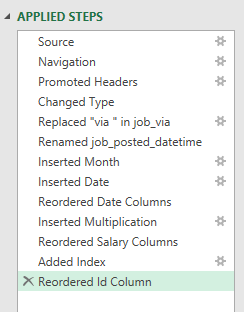
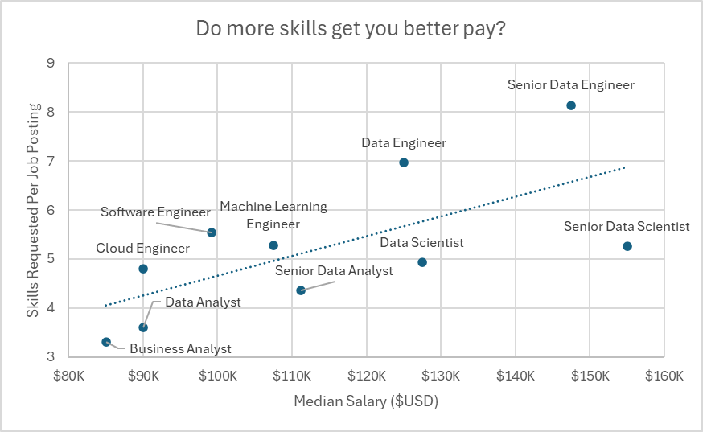
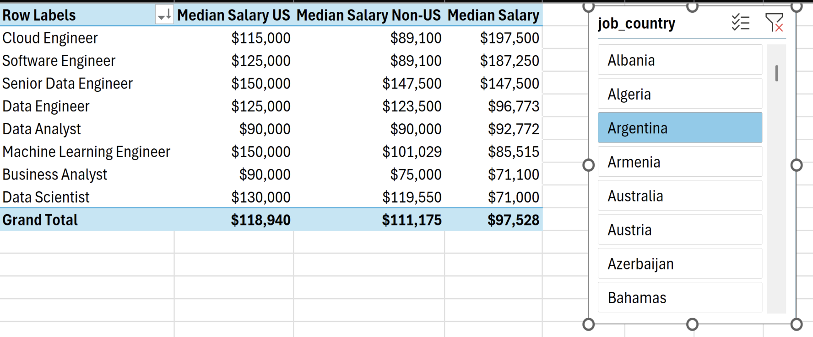
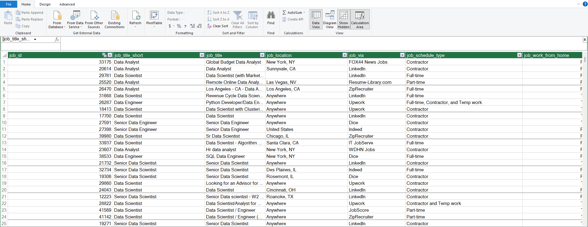
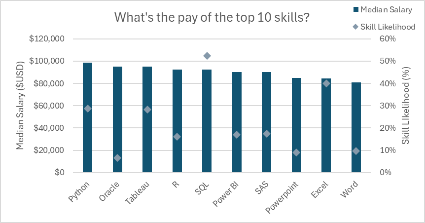

# Job Analysis Dashboard

## 📌 Introduction

This repository showcases two Excel projects built using a real-world 2023 Data Jobs dataset. The first project focuses on building an interactive salary dashboard, while the second expands the analysis using advanced Excel tools such as Power Query, Power Pivot, PivotTables, DAX, and Pivot Charts.

These projects demonstrate how Excel can be used to clean, analyze, visualize, and present data to generate meaningful business insights.

---

## 🛠 Excel Skills Used

Throughout these projects, I applied the following Excel skills:

- 📊 Charts & Pivot Charts
- 📉 Pivot Tables
- 🧮 Formulas & Functions
- 🔄 Power Query (ETL)
- 💪 Power Pivot
- 🧠 DAX (Data Analysis Expressions)
- ✅ Data Validation

---

## 📂 Data Jobs Dataset

The projects use a real-world **2023-2024 Data Jobs** dataset

The dataset includes information on:

- 👨‍💼 Job Titles
- 💰 Salaries
- 📍 Locations
- 🛠 Required Skills
- 💼 Employment Types

---

# 📊 Dashboard

## Overview

This interactive salary dashboard enables users to explore salary trends across data-related careers. Users can filter by **Job Title**, **Country**, and **Employment Type** to compare salaries and identify market trends.


---


## Dashboard Features

- Interactive dashboard
- Dynamic salary calculations
- Country-level salary visualization
- User-friendly dropdown filters
- Automatic chart updates

---

## 📉 Data Science Job Salaries


### Highlights

- Built using Excel's Bar Chart.
- Displays median salary by job title.
- Sorted from highest to lowest salary.
- Makes salary comparisons quick and intuitive.

### Key Insight

Senior Data Engineers and Data Scientists command the highest salaries, while Analyst roles generally receive lower median compensation.

---

## 🌍 Country Median Salaries


### Highlights

- Built using Excel's Map Chart.
- Color-coded by median salary.
- Highlights salary differences across countries.

### Key Insight

Compensation varies significantly by region, making location an important factor when evaluating data careers.

---

## 🧮 Dynamic Formulas

### Median Salary Calculation

```excel
=MEDIAN(
IF(
    (jobs[job_title_short]=A2)*
    (jobs[job_country]=country)*
    (ISNUMBER(SEARCH(type,jobs[job_schedule_type])))*
    (jobs[salary_year_avg]<>0),
    jobs[salary_year_avg]
)
)
```

**Purpose**

Calculates the median salary dynamically based on the selected Job Title, Country, and Employment Type.

---


## ✅ Data Validation


Data Validation was used to create interactive dropdown menus that:

- Restrict invalid user inputs.
- Improve dashboard usability.
- Ensure consistent filtering across all dashboard visuals.

---

## 📌 Dashboard Results

This dashboard allows users to:

- Compare salaries across multiple job titles.
- Explore salary differences between countries.
- Analyze employment types using interactive filters.
- Better understand salary trends within the data job market.

---

# 📊 Job Analysis Dashboard 2.0

## Overview

Dashboard 2.0 extends the analysis beyond visualization by exploring the relationship between salaries, skills, and regional differences using Excel's advanced analytics features.

### Questions Answered

1. Do more skills lead to higher salaries?
2. How do salaries vary across different regions?
3. What are the most in-demand skills?
4. Which skills command the highest salaries?

## 🔄 Power Query (ETL)

Power Query was used to prepare the raw dataset before analysis. The workflow included importing, cleaning, transforming, and loading the data into Excel for further analysis.



### Tasks Performed

- Imported the raw dataset into Excel.
- Removed unnecessary columns.
- Standardized data types.
- Cleaned and trimmed text values.
- Created separate tables for jobs and skills.
- Loaded the transformed data into the workbook.

---

## 📈 Analysis 1 — Do More Skills Lead to Higher Salaries?



### Tools Used

- Power Query
- PivotTables
- Pivot Charts

### Key Insights

- Job postings requiring more technical skills generally offer higher median salaries.
- Senior Data Engineers and Data Scientists show the strongest relationship between skill requirements and salary.
- Business Analyst roles typically require fewer technical skills and offer comparatively lower salaries.

---

## 🌍 Analysis 2 — Salary Comparison by Region

### DAX Measures

```DAX
=CALCULATE(
    MEDIAN(data_jobs_all[salary_year_avg]),
    data_jobs_all[job_country] = "United States")
```

```DAX
Median Salary := MEDIAN(data_jobs_all[salary_year_avg])
```



### Tools Used

- Power Pivot
- PivotTables
- DAX

### Key Insights

- Senior Data Engineers and Data Scientists earn the highest salaries globally.
- US salaries are generally higher than salaries in other regions.
- Geographic location plays a major role in salary differences.

---

## 💻 Analysis 3 — Most In-Demand Skills

### Data Model

Power Pivot was used to build a relational data model by connecting the `data_jobs_all` and `data_jobs_skills` tables using the `job_id` field.




---


### Key Insights

- SQL and Python are the most frequently requested skills.
- Cloud technologies such as AWS and Azure continue to grow in demand.
- Employers increasingly value professionals with programming, database, and cloud computing expertise.

---

## 💰 Analysis 4 — Top Paying Skills



### Tools Used

- Pivot Charts
- Power Pivot
- DAX

### Key Insights

- Python, SQL, and Oracle are associated with the highest median salaries.
- Specialized technical skills consistently lead to better-paying opportunities.
- General productivity tools such as Microsoft Word and PowerPoint are linked to lower salary levels.

---

# 🎯 Final Conclusion

These two dashboards demonstrate how Excel can be used as a complete data analytics platform—from data cleaning and transformation to interactive dashboards and advanced business analysis.

Throughout this project, I applied **Power Query**, **Power Pivot**, **PivotTables**, **Pivot Charts**, **DAX**, **Formulas**, and **Data Validation** to analyze a real-world data jobs dataset and uncover insights into salary trends, regional differences, and the skills most associated with high-paying careers.

This repository highlights both dashboard development and analytical problem-solving, showcasing practical Excel techniques that can be applied to real-world business and data analytics projects.