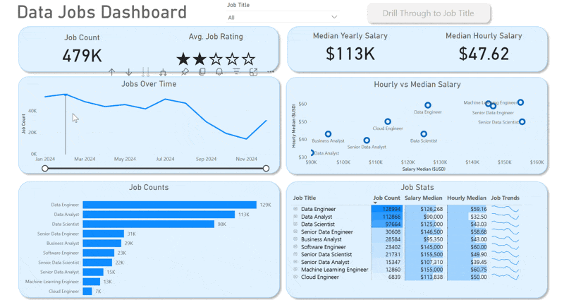
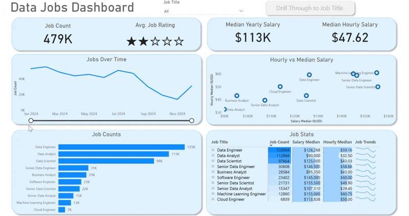
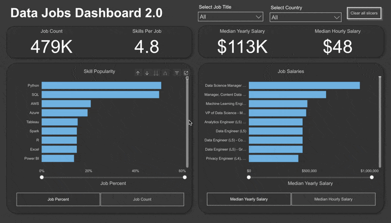

# Data Jobs Dashboard 
  
</a>

---

# Introduction

Finding reliable information about the data job market can be challenging, with salary, hiring, and location insights often scattered across multiple sources.

This dashboard was built to help **job seekers, career changers, and aspiring data professionals** explore the market through an interactive and data-driven experience. Using a real-world dataset.The report consolidates information on salaries, job titles, hiring locations, and remote work opportunities into a single, intuitive dashboard that supports informed career decisions.

### Dashboard File

You can find the Power BI project file here:

[`Data_Jobs_Dashboard.pbix`](Data_Jobs_Dashboard.pbix)

---

# Skills Demonstrated

This project showcases the complete Power BI analytics workflow, from data preparation to interactive dashboard development.

### ⚙️ Data Transformation (Power Query)

* Cleaned and transformed raw job posting data
* Handled missing values and corrected data types
* Created calculated columns for improved analysis
* Prepared data for reporting through ETL processes

### 🧮 DAX & Measures

* Developed measures to calculate:

  * Median Yearly Salary
  * Job Count
  * Other key performance indicators (KPIs)

### 📊 Data Visualization

Built a variety of visuals to communicate insights effectively, including:

* Column Charts
* Bar Charts
* Line Charts
* Area Charts
* KPI Cards
* Tables
* Map Visualizations

### 🗺️ Geospatial Analysis

* Visualized the global distribution of job opportunities using interactive maps.

### 🖱️ Interactive Reporting

Implemented user-friendly navigation features such as:

* **Slicers** for dynamic filtering by Job Title
* **Buttons & Bookmarks** for seamless report navigation
* **Drill-Through Pages** for exploring detailed insights from summary visuals

---

# Dashboard Overview

This report is divided into **two interactive pages**, providing both a high-level overview of the job market and detailed role-specific insights.

## 📈 Page 1 — Data Job Market Overview

The landing page provides an executive summary of the data job market, highlighting key metrics such as:

* Total Job Count
* Median Yearly Salary
* Median Hourly Salary
* Top Hiring Job Titles
* Overall Market Trends

Designed as a central dashboard, it enables users to quickly understand current hiring patterns and compensation trends.

---

## 🔍 Page 2 — Job Title Drill-Through

The drill-through page delivers detailed insights for a selected job title, including:

* Salary distribution
* Work-from-home availability
* Top hiring platforms
* Geographic distribution of job postings

This page allows users to perform a deeper analysis and compare opportunities across specific roles.

---

# Conclusion

This dashboard demonstrates how Power BI can transform raw job posting data into meaningful business insights through interactive visualizations and intuitive reporting.

By enabling users to filter, drill through, and explore hiring trends, salary benchmarks, and job demand, the dashboard serves as a practical decision-support tool for anyone planning a career in data.

---

# Data Jobs Dashboard 2.0 w/ Power BI

  
</a>

---

# Introduction

Version 2.0 builds upon the original dashboard by delivering a more streamlined and focused reporting experience.

Instead of navigating multiple pages, users can now access the most valuable market insights from a **single interactive dashboard**, making exploration faster and more intuitive.

Built using the same real-world **2024 data science job postings** dataset, this version emphasizes usability, cleaner design, and quicker access to key performance indicators.

### Dashboard File

You can find the Power BI project file here:

[`Data_Jobs_Dashboard_2.0.pbix`](Data_Jobs_Dashboard_2.0.pbix)

---

# Skills Demonstrated

Version 2.0 further strengthens core Power BI skills by applying best practices in dashboard development.

### 🎨 Dashboard Design

* Designed a clean, user-centric dashboard layout
* Improved visual hierarchy and readability
* Optimized the user experience through a single-page design

### ⚙️ Power Query (ETL)

* Cleaned and transformed raw datasets
* Standardized data for reporting
* Improved overall data quality

### 🔗 Data Modeling

* Built efficient relationships following **Star Schema** principles
* Optimized the data model for performance and scalability

### 🧮 DAX

Created calculations and KPIs to provide actionable business insights.

### 📊 Visualizations

Implemented a variety of visuals, including:

* Column Charts
* Bar Charts
* Line Charts
* Area Charts
* KPI Cards
* Tables
* Interactive Maps

### 🖱️ Interactive Features

* Dynamic slicers
* Buttons
* Bookmarks
* Drill-through navigation

---

# Dashboard Overview

## 📊 Single-Page Dashboard

The redesigned dashboard consolidates the most important job market metrics into one streamlined report.

Users can quickly explore:

* Total Job Count
* Skills Per Job
* Median Yearly Salary
* Median Hourly Salary
* Skill Popularity
* Salary Comparison Across Job Titles

The simplified layout enables users to gain meaningful insights with fewer interactions while maintaining a rich, interactive experience.

---

# Conclusion

Version 2.0 demonstrates an evolution in dashboard design by combining powerful analytics with a cleaner, more efficient user experience.

By integrating robust data modeling, DAX calculations, interactive filtering, and intuitive visualizations into a single-page report, this dashboard provides job seekers with actionable insights to better understand hiring trends, salary expectations, and the skills shaping today's data job market.
